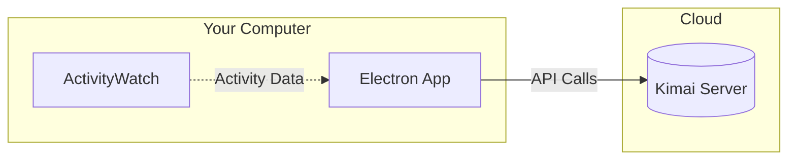
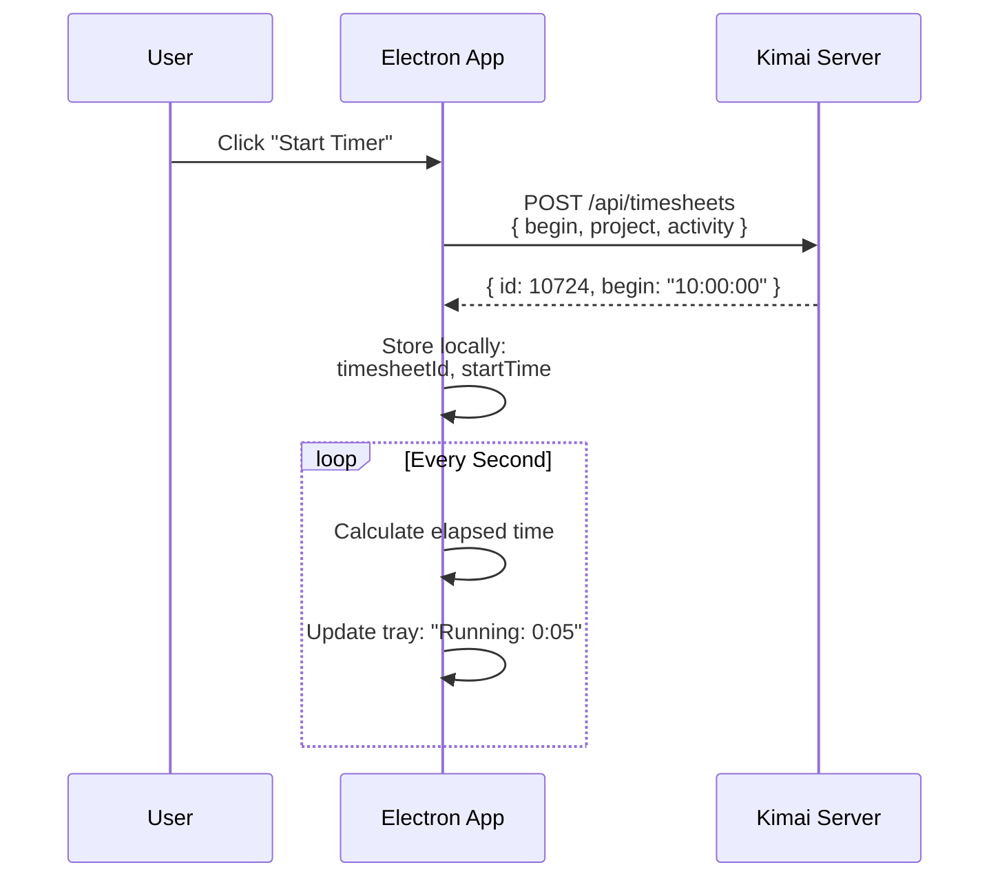
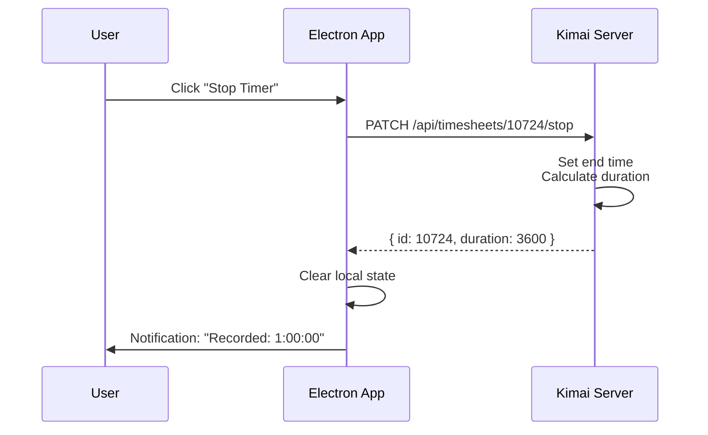
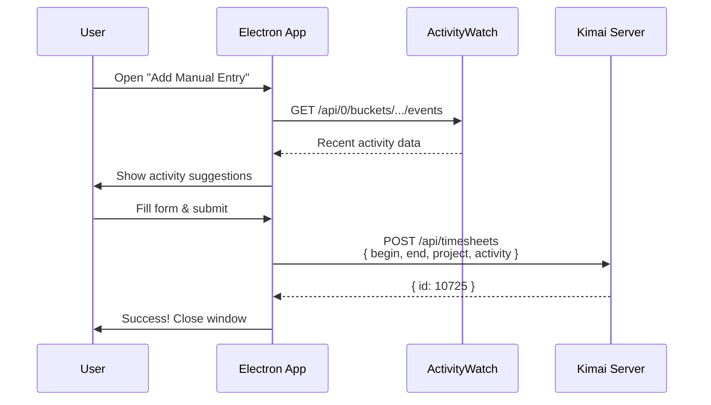

# How Time Tracking Works

The Electron app acts as a **remote control** for Kimai - it doesn't track time locally. All time data lives on Kimai's server.

## Architecture Overview



## Starting a Timer



### What Gets Sent to Kimai

```json
{
  "begin": "2026-01-29T10:00:00",
  "project": 7,
  "activity": 1,
  "description": "Working on feature X"
}
```

Note: **No `end` time** = timer is running on Kimai

## Stopping a Timer



## Manual Time Entry



## Data Flow Summary

```
┌─────────────────────────────────────────────────────────────────┐
│                        ELECTRON APP                              │
│  ┌─────────────┐    ┌─────────────┐    ┌─────────────┐         │
│  │  Tray Menu  │    │  Settings   │    │ Time Entry  │         │
│  └──────┬──────┘    └──────┬──────┘    └──────┬──────┘         │
│         │                  │                  │                 │
│         └────────────┬─────┴─────┬────────────┘                 │
│                      │           │                              │
│              ┌───────▼───────┐   │                              │
│              │  electron-    │   │                              │
│              │  store        │   │                              │
│              │  (settings,   │   │                              │
│              │   timer state)│   │                              │
│              └───────────────┘   │                              │
│                                  │                              │
│         ┌────────────────────────┼────────────────────┐        │
│         │                        │                    │        │
│  ┌──────▼──────┐          ┌──────▼──────┐    ┌───────▼──────┐  │
│  │ kimai.ts    │          │ activitywatch│    │  store.ts   │  │
│  │ (API calls) │          │ .ts          │    │  (persist)  │  │
│  └──────┬──────┘          └──────┬───────┘    └─────────────┘  │
└─────────┼────────────────────────┼──────────────────────────────┘
          │                        │
          ▼                        ▼
   ┌──────────────┐        ┌───────────────┐
   │    KIMAI     │        │ ACTIVITYWATCH │
   │   (Cloud)    │        │   (Local)     │
   │              │        │               │
   │ - Timesheets │        │ - Window logs │
   │ - Projects   │        │ - AFK status  │
   │ - Activities │        │ - App usage   │
   └──────────────┘        └───────────────┘
```

## What's Stored Where

| Location | Data |
|----------|------|
| **Kimai Server** | Timesheets, projects, activities, customers, rates |
| **Electron Store** (local) | API credentials, timer state, default project/activity |
| **ActivityWatch** (local) | App usage, window titles, AFK status |

## Key Behavior

1. **App closes while timer running?** Timer keeps running on Kimai. When you reopen, app syncs with server.

2. **No internet?** App won't work - it needs Kimai connection for all operations.

3. **Multiple devices?** Timer started on one device shows on all (it's server-side).
